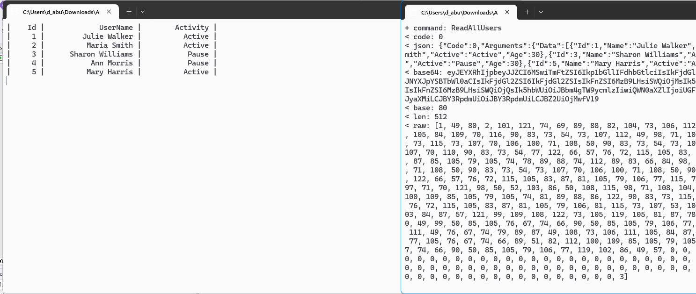
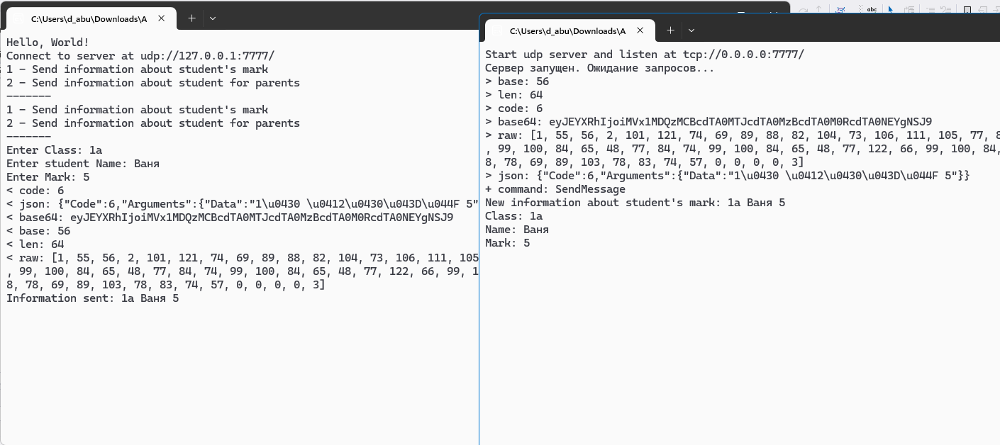

# TCP Приложение для симуляции активности пользователей

## Описание проекта

Этот проект представляет собой клиентское приложение, написанное на C#, которое взаимодействует с сервером через протокол TCP. Приложение предназначено для управления пользователями, получая данные о них и обновляя их состояние активности.


### Предварительные требования

- .NET SDK (версия 6.0 или выше)
- Доступ к серверу, работающему на `tcp://127.0.0.1:5555`

### Шаги по установке

1. Клонируйте репозиторий:

   ```bash
   git clone <URL_репозитория>
   cd <имя_папки_репозитория>
   ```

2. Соберите проект:

   ```bash
   dotnet build
   ```

3. Запустите приложение:

   ```bash
   dotnet run
   ```

## Использование

После запуска приложения оно подключится к серверу и начнет получать информацию о пользователях. Приложение будет периодически обновлять состояние активности пользователей с использованием случайных значений.

### Основные функции

- **Подключение к серверу**: Клиент устанавливает соединение с сервером по адресу `tcp://127.0.0.1:5555`.
- **Получение списка пользователей**: Приложение запрашивает и отображает список всех пользователей с их идентификаторами, именами и состоянием активности.
- **Обновление активности пользователей**: Каждую секунду приложение случайным образом выбирает пользователя и обновляет его состояние активности.

## Объяснение кода

### Основной класс `Program`

- **`Main` метод**: Является точкой входа в приложение. Здесь создается объект клиента `NetTcpClient`, который подключается к серверу по указанному адресу.
  
  ```csharp
  var serverAdress = new Uri("tcp://127.0.0.1:5555");
  var client = new NetTcpClient(serverAdress);
  await client.ConnectAsync();
  ```

- **`ManageUsers` метод**: Этот метод отвечает за управление пользователями. Он получает список пользователей с сервера, отображает их и обновляет их состояние активности.

  ```csharp
  var users = await userApi.GetAllAsync();
  ```

### Управление пользователями

- **Цикл обновления**: Внутри метода `ManageUsers` имеется бесконечный цикл, который выполняется до тех пор, пока приложение активно. В этом цикле происходит:
  - Получение списка пользователей.
  - Очистка консоли и вывод информации о пользователях.
  - Генерация случайных идентификаторов пользователей и состояний активности.
  
  ```csharp
  Random random = new Random();
  int UserId = random.Next(1, 6);
  int ActivityId = random.Next(0, 3);
  ```

- **Обновление пользователя**: После получения случайного пользователя и его активности создается новый объект `User`, который затем отправляется на сервер для обновления.

  ```csharp
  var addUser = new User(
      Id: user1.Id,
      Name: user1?.Name,
      Age: 30,
      Active: Array[ActivityId]
  );
  var addResult = await userApi.UpdateAsync(UserId, addUser); 
  ```

## Структура кода

- **`Program.cs`**: Основной файл приложения, содержащий логику подключения к серверу и управления пользователями.
- **`UserApiClient`**: Класс для взаимодействия с API пользователей на сервере.
- **`User`**: Модель данных для представления информации о пользователе.

## Примечания

- Убедитесь, что сервер запущен и доступен перед запуском клиента.
- Для корректной работы необходимо, чтобы сервер поддерживал API, используемое в этом приложении.

## Скриншоты

---

# UDP Система электронного дневника

## Описание проекта

Этот проект представляет собой клиентское приложение, написанное на C#, которое использует протокол UDP для отправки сообщений на сервер. Приложение позволяет пользователю вводить информацию о студентах и их оценках, а также отправлять сообщения родителям.


### Предварительные требования

- .NET SDK (версия 6.0 или выше)
- Доступ к серверу, работающему на `udp://127.0.0.1:7777`


## Использование

После запуска приложения оно подключится к серверу и предложит пользователю меню для отправки сообщений. Пользователь может выбрать один из двух вариантов:

1. Отправить информацию о студенте и его оценке.
2. Отправить информацию для родителей.

### Основные функции

- **Подключение к серверу**: Клиент устанавливает соединение с сервером по адресу `udp://127.0.0.1:7777`.
- **Отправка сообщений**: Пользователь может вводить данные о студенте и оценке, которые затем отправляются на сервер.
- **Информация для родителей**: Пользователь может ввести информацию, предназначенную для родителей студентов.

## Объяснение кода

### Основной класс `Program`

- **`Main` метод**: Точка входа в приложение. Здесь создается объект клиента `NetUdpClient`, который подключается к серверу по указанному адресу.

  ```csharp
  var serverAdress = new Uri("udp://127.0.0.1:7777");
  var client = new NetUdpClient(serverAdress);
  ```

- **`ManageMessages` метод**: Этот метод отвечает за управление отправкой сообщений. Он отображает меню и обрабатывает пользовательский ввод.

  ```csharp
  PrintMenu();
  ```

### Управление сообщениями

- **Цикл обработки ввода**: Внутри метода `ManageMessages` реализован бесконечный цикл, который ожидает нажатия клавиш от пользователя:
  - Если нажата клавиша `1`, пользователь вводит данные о студенте и его оценке, которые затем отправляются на сервер.
  
    ```csharp
    if (key.Key == ConsoleKey.D1) 
    {
        // Ввод данных о студенте
    }
    ```

  - Если нажата клавиша `2`, пользователь вводит информацию для родителей, которая также отправляется на сервер.
  
    ```csharp
    if (key.Key == ConsoleKey.D2)
    {
        // Ввод информации для родителей
    }
    ```

  - Если нажата клавиша `Escape`, цикл завершается, и приложение завершает свою работу.
  
    ```csharp
    if (key.Key == ConsoleKey.Escape)
    {
        break;
    }
    ```

### Печать меню

- **`PrintMenu` метод**: Этот метод выводит доступные опции для пользователя в консоль.

  ```csharp
  lock (_locker)
  {
      Console.WriteLine("1 - Send information about student's mark");
      Console.WriteLine("2 - Send information about student for parents");
      Console.WriteLine("-------");
  }
  ```

## Структура кода

- **`Program.cs`**: Основной файл приложения, содержащий логику подключения к серверу и управления сообщениями.
- **`MessageApiClient`**: Класс для взаимодействия с API сообщений на сервере.

## Примечания

- Убедитесь, что сервер запущен и доступен перед запуском клиента.
- Для корректной работы необходимо, чтобы сервер поддерживал API, используемое в этом приложении.

## Скриншоты

